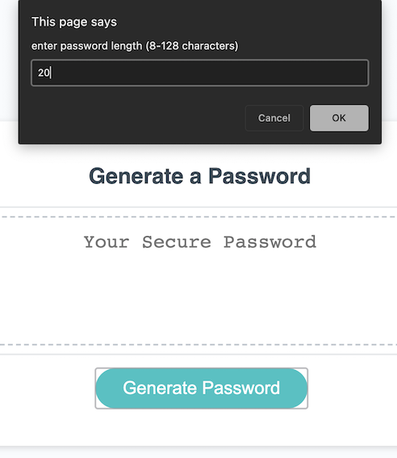

# <Javascript Password Generator>

## Description
This application generates a randomized string of characters based on input from a user. 

## Features 
Users can: 
    <ul>
    <li>set length within a provided range</li>
    <li>select 1-4 character types to include</li> 
    </ul>

## Installation
This application 


## Usage 
1. click generate button to start application
2. enter a number for desired password length in text box 
3. click okay to include or cancel to exclude on each character type as they are presented 
4. generated password will appear in the text field on the page 
5. select and copy 

<!-- To add a screenshot, create an `assets/images` folder in your repository and upload your screenshot to it. Then, using the relative filepath, add it to your README using the following syntax:
    ```md
      -->

## Credits
Solution for preventing non-number input for length provided by [Rob M.](https://stackoverflow.com/users/693275/rob-m) in [this Stack Overflow thread](https://stackoverflow.com/questions/15047140/javascript-prompt-number-and-continue-prompting-if-answer-is-wrong)

Solution for shuffling the generated string of characters provided by [Joel Mellon](https://stackoverflow.com/users/430151/joel-mellon) in [this Stack Overflow thread](https://stackoverflow.com/questions/3943772/how-do-i-shuffle-the-characters-in-a-string-in-javascript/13365977#13365977)

Function code for random character generation originally provided by [Florin Pop](https://codepen.io/FlorinPop17), viewable on his [his CodePen](https://codepen.io/FlorinPop17/pen/BaBePej) and demonstrated by [Brad Traverysy of Traversy Media](https://traversymedia.com/) in [this YouTube video](https://www.youtube.com/watch?v=duNmhKgtcsI&t=914s)


<!-- ## License
The last section of a high-quality README file is the license. This lets other developers know what they can and cannot do with your project. If you need help choosing a license, refer to [https://choosealicense.com/](https://choosealicense.com/).

---

🏆 The previous sections are the bare minimum, and your project will ultimately determine the content of this document. You might also want to consider adding the following sections.

## Badges

Badges aren't necessary, per se, but they demonstrate street cred. Badges let other developers know that you know what you're doing. Check out the badges hosted by [shields.io](https://shields.io/). You may not understand what they all represent now, but you will in time.

## Features
If your project has a lot of features, list them here.

## How to Contribute
If you created an application or package and would like other developers to contribute it, you can include guidelines for how to do so. The [Contributor Covenant](https://www.contributor-covenant.org/) is an industry standard, but you can always write your own if you'd prefer.

## Tests
Go the extra mile and write tests for your application. Then provide examples on how to run them here. -->

## Testing
Quality of passwords produced by this generator were [tested for stregth](https://www.comparitech.com/privacy-security-tools/password-strength-test/). As expected, when users choose longer passwords with multiple character types, strong passwords are produced. 

    ```md
    
    ```
